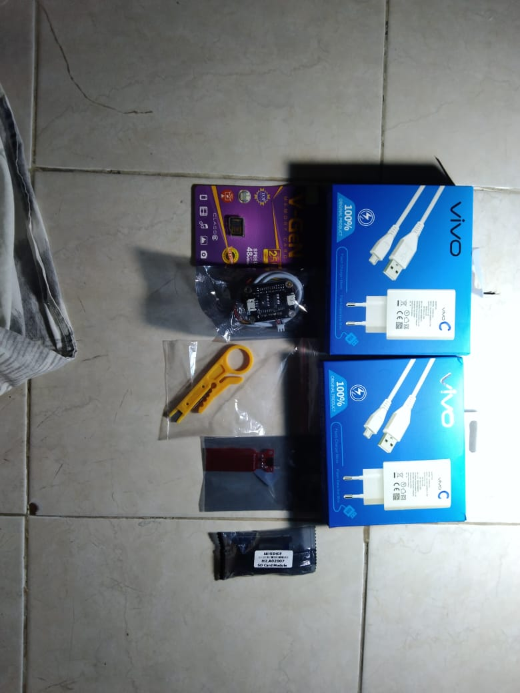
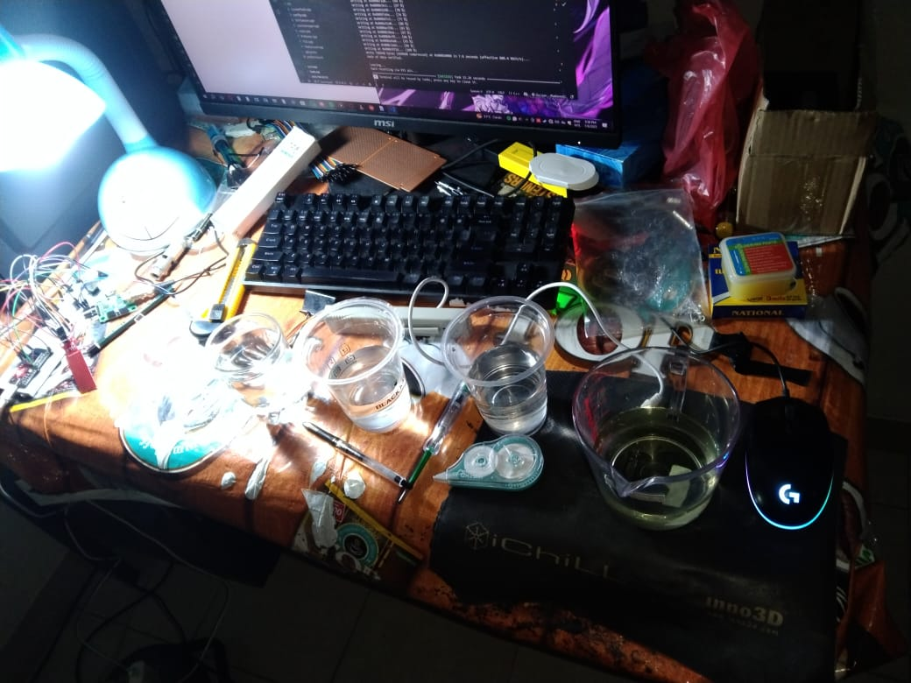
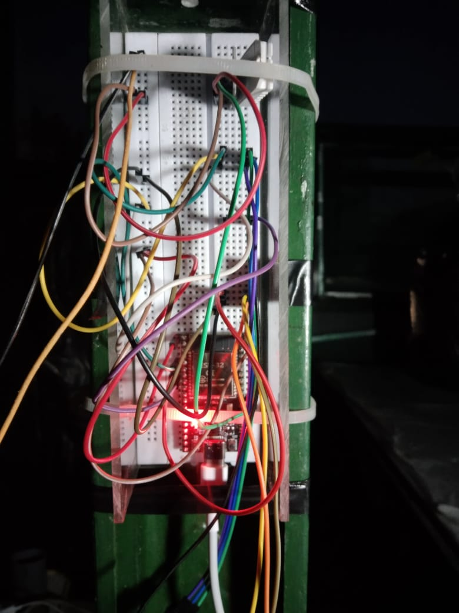
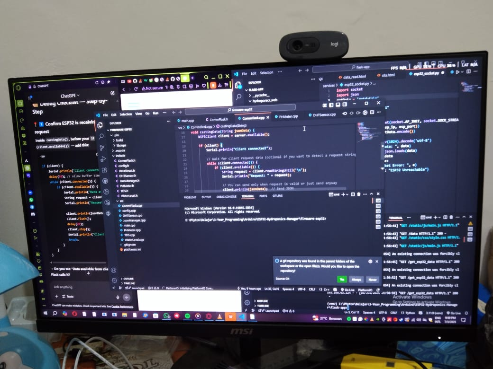

# 🌱 ESP32-Hydroponics-Manager

> An IoT-based hydroponics monitoring system using ESP32
> 
> Youtube Vid: https://youtu.be/xbaBJFVSLGI

## 📊 Features (MVP)
- Real-time pH sensor reading
- TDS (PPM) sensor monitoring
- Water level detection
- Data sent via serial to Java Android app
- (The SD card module is broken so no saving data 🐧💀)

## 🖨 Hardware List 
- ESP32 CP2102 38 Pin
- pH Meter Sensor (PH-4502C with Probe)
- TDS Meter Sensor
- DHT22
- Water level sensor
- USB Power Adapter + USB C Cable
- Jumper Wires
- Project board

## 🖥 Software & Dependencies
- 💻 Software :
  - PlatformIO (Arduino Framework)
  - Flask web for companion app
  
- 📚 Library / Dependencies:
  - | Sensor        | Library       |
    | ------------- | ------------- |
    | DHT22  | Adafruit DHT sensor library|
    | TDS Meter  | Analog reading (No library)  |
    | Water Level Sensor | Analog reading (No Library)|
    | pH Meter | Analog reading (No Library) |

## 🚀 How To Use
1. 📩 Upload ESP32 firmware via PlatformIO
2. ⚡ Connect sensors to ESP32 (Later see wiring diagrams)
3. 📲 Connect to ESP32's wifi and start the flask app

## 📷 Doccumentation

|   |  |
| ---------------- | ----------------- |
|   |  |

> Full documentation: [Documentation](docs/)  

### Fun Fact 🐧
> Before this project, I practiced soldering by trying to fix my broken controller, controller still broken after ~10 hours of soldering 🐧💀

## 📃 License 
> MIT License - see [License](LICENSE)

## 📔 Summary & Current condition
> So in setting up the ESP32 and sensor in my dad's warehouse, the TDS Sensor broke, and because of the hecticness of my dad's schedule, the pH sensor and ESP are left with no use 💀🐧  
> Even though in the end the project doesn't come close to production, I learned a lot. From embedded quirks to how fragile hardware (sensors and modules) is, and most importantly, I learned grit.  
> I recalibrated the TDS Sensor (Even though in the end it's broken 🐧💀) multiple times with my broken PC USB ports emitting electricity, how I turned my bedroom into a mini science lab for calibration, and how I broke multiple modules and sensors in one single project 💀🐧  
> TLDR : I broke stuff, I lost money, I gained experience 🐧💀

## Remember 🌠!
> *"Sometimes the biggest idea comes from idling around and being bored !"* - Made by [**Bernardusz**](https://github.com/Bernardusz), a 10th grader bored in a holiday
---
> Made while joking about *"The Qing Empire has called us into the Kugu Jumo servant - Hungarian war"*
